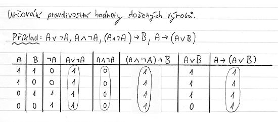

# Otázka 3
## Obsah
1. Tabulková metoda
2. Sémantické vyplývání ve výrokové logice

## Tabulková metoda
Je jednoduchá metoda, jak vyhodnotit formuli.
Do tabulky zaneseme všechna ohodnocení, takže tabulka má 2n řádků. 
Příklad tabulky:

## Sémantické vyplývání
Formule `ϕ` sémanticky vyplývá z množiny `T` formulí, označujeme `T |= ϕ`, jestliže ϕ je pravdivá při každém ohodnocení, při kterém jsou pravdivé všechny formule z `T`.

Formule `ϕ` a `ψ` jsou sémanticky **ekvivalentní**, pokud `||ϕ||``e`` = ||ψ||``e` pro každé ohodnocení `e`.
