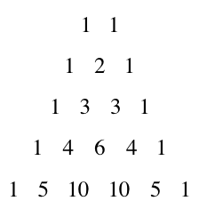

# Otázka 21
## Obsah
1. Binomická věta
2. Princip inkluze a exkluze

## Binomická věta
Díky binomické větě můžeme snadno vypočítat \( (a + b)^n \) věta zní tokto:
$$
(a + b)^n = ∑_{k = 0}^{n} (_{n}^{k}) a^{n−k} b^k
$$
Platí pro \( a, b ∈ ℝ; n ∈ ℕ \)

**Pascalův trojúhelník:** 

**Pascalův trojúhelník pomocí kombinačních čísel:** 

## Princip inkluze a exkluze
Sjednocení dvou množin:
$$
|A ∪ B| = |A| + |B| - |A ∩ B|
$$
Sjednocení tří množin:
$$
|A ∪ B ∪ C| = |A| + |B| + |C| - |A ∩ B| - |B ∩ C| - |C ∩ A| + |A ∩ B ∩ C|
$$
